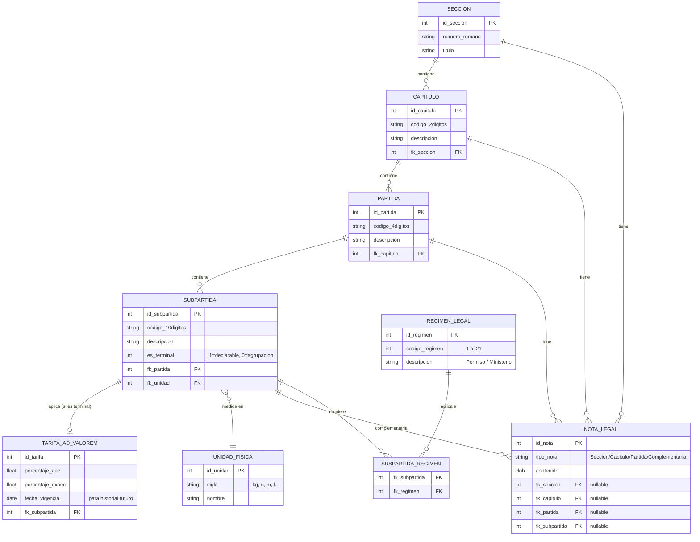

# Diagrama de Entidad-Relación — Arancel de Aduanas Venezuela
## Sistema: Proyecto ING, Sistema Ronny

---

## Correcciones aplicadas respecto al modelo anterior:
1. ✅ Entidad `PARTIDA` definida con sus atributos completos y FK.
2. ✅ Entidades `UNIDAD_FISICA` y `TARIFA_AD_VALOREM` definidas con atributos.
3. ✅ Relación muchos-a-muchos `SUBPARTIDA ↔ REGIMEN_LEGAL` resuelta mediante tabla intermedia `SUBPARTIDA_REGIMEN`.
4. ✅ Entidad `NOTA_LEGAL` incluye las 4 FKs opcionales (nullables) para vincularse a Sección, Capítulo, Partida o Subpartida.

## Decisiones de diseño aplicadas:
- `NOTA_LEGAL` es entidad **unificada** con 4 FKs opcionales (facilita consultas en Metabase).
- `TARIFA_AD_VALOREM` es **tabla separada** (soporta historial con `fecha_vigencia` a futuro).
- Relación `SUBPARTIDA ||--o| TARIFA_AD_VALOREM` es **opcional**: solo las subpartidas terminales tienen tarifa.
- Campo `es_terminal` en `SUBPARTIDA`: bandera (1=declarable/con tarifa, 0=agrupación padre).

---



---

## Regla de integridad para NOTA_LEGAL
Una nota legal debe tener **exactamente uno** de los cuatro FKs con valor (el resto `NULL`).
Esta regla se puede aplicar con un CHECK constraint en Oracle:

```sql
CONSTRAINT chk_nota_un_nivel CHECK (
    (CASE WHEN fk_seccion    IS NOT NULL THEN 1 ELSE 0 END +
     CASE WHEN fk_capitulo   IS NOT NULL THEN 1 ELSE 0 END +
     CASE WHEN fk_partida    IS NOT NULL THEN 1 ELSE 0 END +
     CASE WHEN fk_subpartida IS NOT NULL THEN 1 ELSE 0 END) = 1
)
```

---

## Jerarquía completa del modelo
```
SECCION
  └── CAPITULO
        └── PARTIDA
              └── SUBPARTIDA (es_terminal = 1 → tiene TARIFA)
                    ├── TARIFA_AD_VALOREM
                    ├── UNIDAD_FISICA
                    └── REGIMEN_LEGAL (via SUBPARTIDA_REGIMEN)

NOTA_LEGAL → vinculada a cualquier nivel (Sección, Capítulo, Partida o Subpartida)
```
